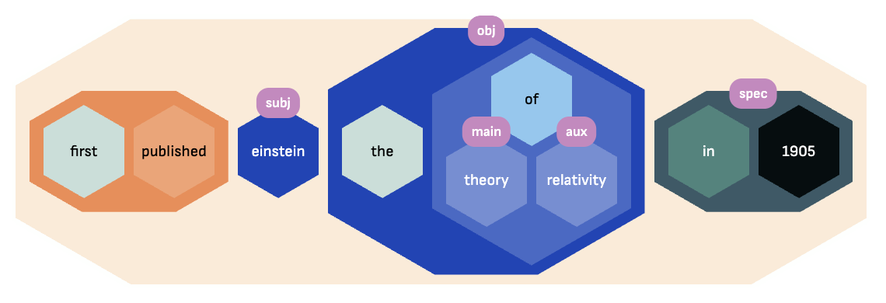

# Hyperbase

## A foundational library for Semantic Hypergraphs

!!! note
    [Read our publications and explore some use cases](pubs-cases.md).

Hyperbase is a foundational Python library for working with *Semantic Hypergraphs (SH)*, which make it possible to represent a natural language sentence such as "Einstein first published the theory of relativity in 1905" in a structured way:

<figure markdown="span">
  { width="75%" }
</figure>

In SH notation, this is represented as:

```text
((first/M published/P.sox)
    einstein/C
    (the/M
        (of/B.ma theory/C relativity/C))
    (in/T 1905))
```

## Funding

This software library and its associated research were funded by CNRS and the ERC Consolidator
Grant [Socsemics](https://socsemics.huma-num.fr/) (grant #772743).
