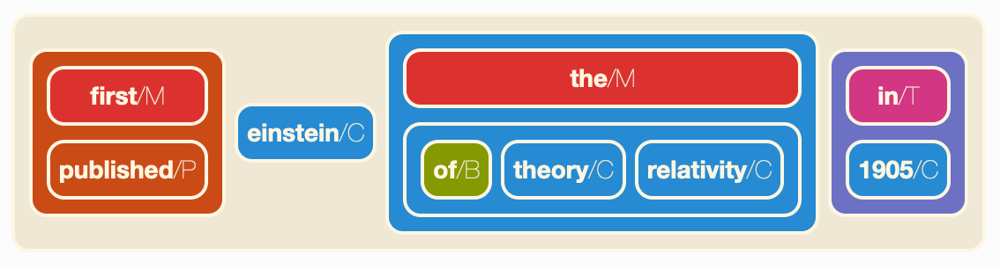

# Hyperbase

## A foundational library for Semantic Hypergraphs

!!! note
    [Read our publications and explore some use cases](pubs-cases.md).

Hyperbase is a foundational library for working with *Semantic Hypergraphs (SH)*, which make it possible to represent a natural language sentence such as "Einstein first published the theory of relativity in 1905" as an ordered, recursive hyperlink of the form:

<figure markdown="span">
  { width="75%" }
</figure>

Hyperbase is written in Python, to both take advantage and facilitate integration with the rich environment of scientific libraries available in this language. It is released under the highly permissive MIT open source license.

## Funding

This software library and its associated research were funded by CNRS and the ERC Consolidator
Grant [Socsemics](https://socsemics.huma-num.fr/) (grant #772743).
